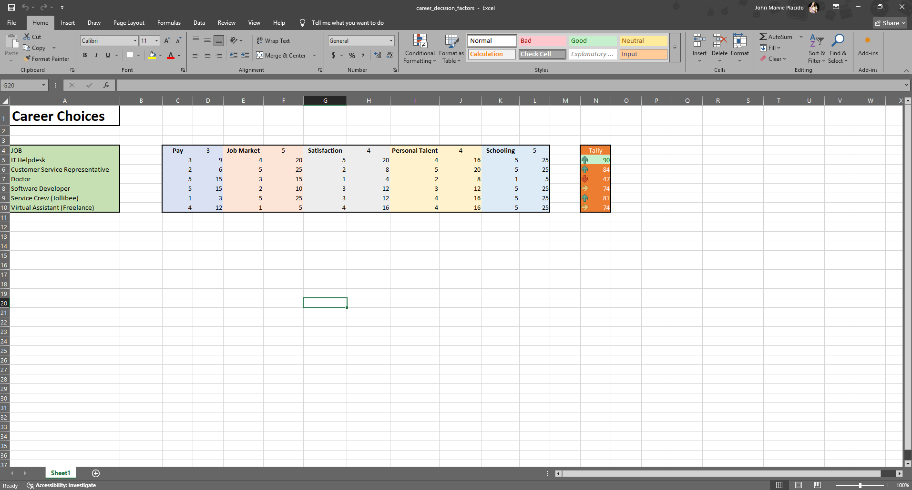

# Career Decision Factor Project

An Excel-based decision-support tool that provides simple statistical insights to help users evaluate potential career paths based on selected criteria.

---

## 📌 Project Overview
This project demonstrates how Excel can be used to organize data, calculate weighted factors, and present results in a clear, visual format. It offers a framework for making career-related decisions by quantifying and comparing different criteria.

---

## 🔧 Key Features
- **Criteria-Based Scoring**: Assigns values to multiple career decision factors.  
- **Automated Calculations**: Uses formulas to generate scores and rankings.   
- **Conditional Formatting**: Highlights top career matches for quick insights.  
- **Charts & Visualization**: Graphs provide a clear comparison of career paths.  
- **Flexible Inputs**: Criteria can be adjusted to reflect personal priorities.  

---

